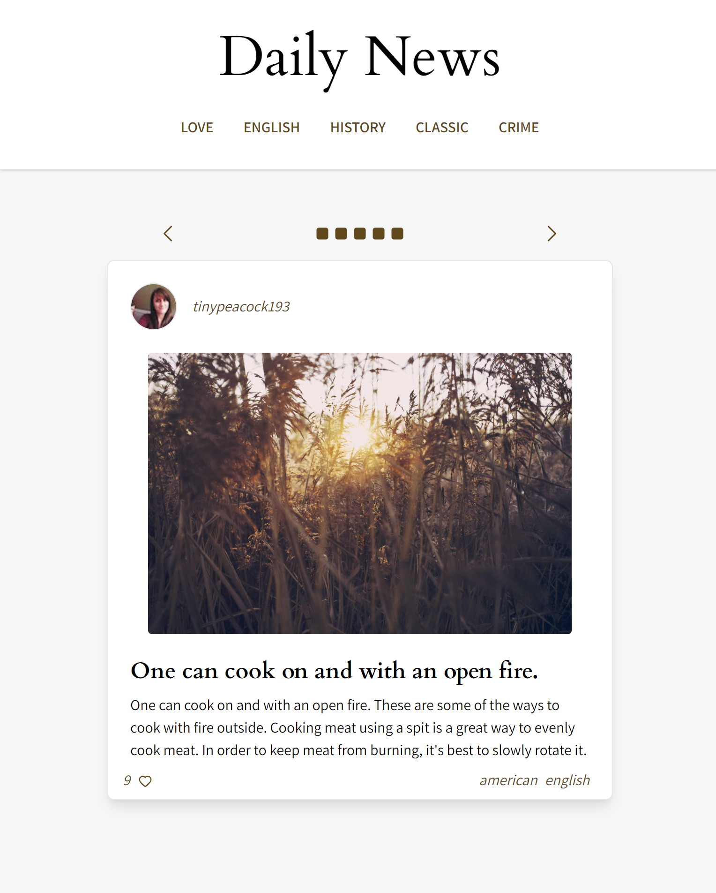
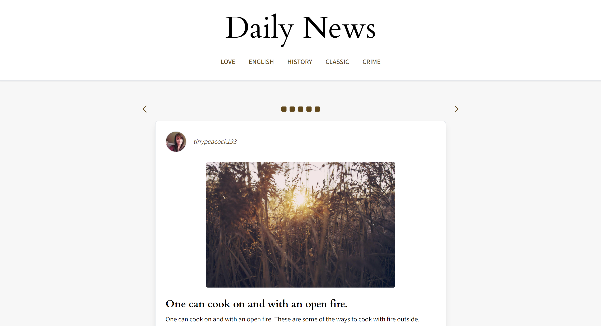
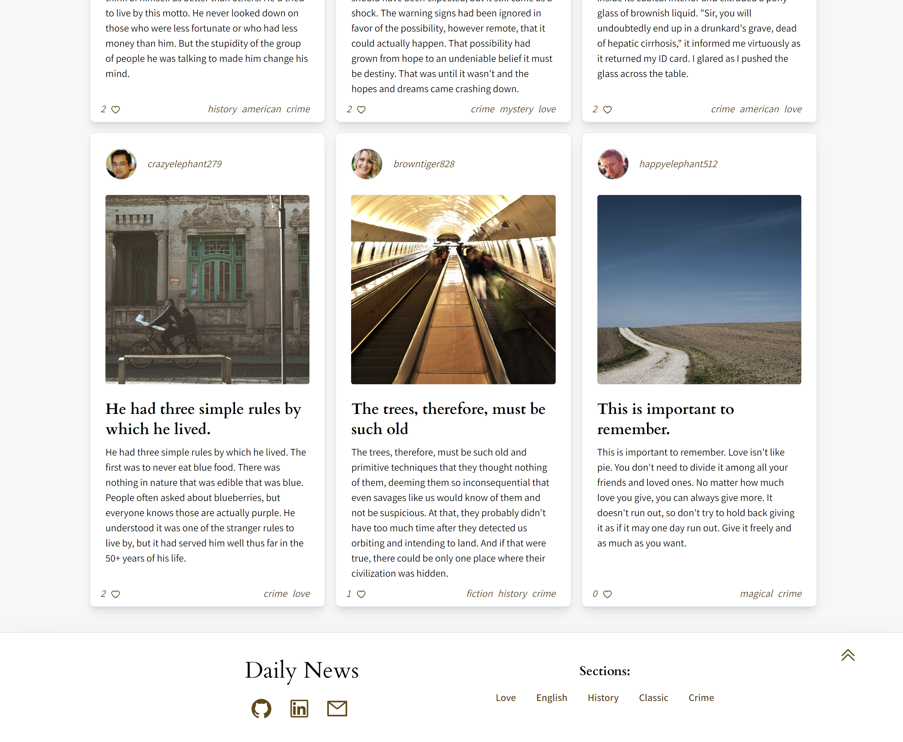

# The Tiny Blog

Welcome to "The Tiny Blog", a full responsive blogging application built with React! This project aims to provide an elegant and cozy user interface for a simple blog, where users can read posts fetched from an external APIs. The project utilizes React hooks like useState, useEffect, and useContext using a custom wrapper provider component. Styling and responsiveness is done using Tailwind CSS.

[Take a look](https://tiny-daily-news.netlify.app/)






## Table of Contents

- [Features](#Features)
- [Installation](#Installation)
- [Technologies](#technologies)
- [License](#license)

## Features

- Fetches blog posts from an API to display on the UI.
- Fetches user information from another API to add author details to each post's userId.
- Utilizes React hooks (useState, useEffect, useContext) for managing state and side effects.
- Implements context using a custom wrapper provider component for data sharing.
- Utilizes Tailwind CSS for styling, responsiveness, providing a sleek and responsive UI.

## Installation

To get started with The Tiny Blog, follow these steps:

1. Clone the repository:

```bash
  git clone https://github.com/Luega/ReactTS-TinyBlog.git
```

2. Navigate to the project directory:

```bash
  cd /ReactTS-TinyBlog
```

3. Install the project dependencies:

```bash
  npm install
```

4. Start the development server:

```bash
  npm run start
```

5. Open your browser and visit http://localhost:3000 to access CozyBlog.

## Technologies

- React: The project is built using the React library, enabling the creation of reusable UI components and managing component state efficiently.
- React Hooks: The app utilizes React hooks such as useState, useEffect and useContext to manage state and side effects.
- Tailwind CSS: The app employs Tailwind CSS for styling and utilizes its utility classes for a streamlined and responsive design.

## License

This project is licensed under the [MIT](https://choosealicense.com/licenses/mit/) License.
